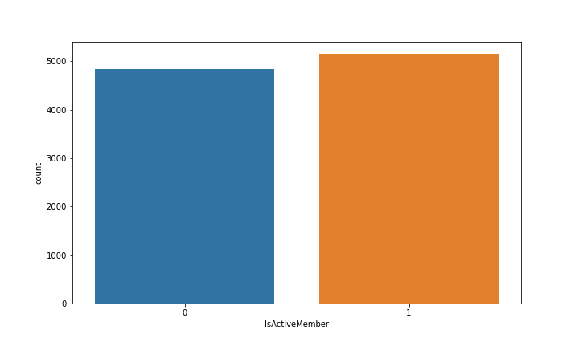
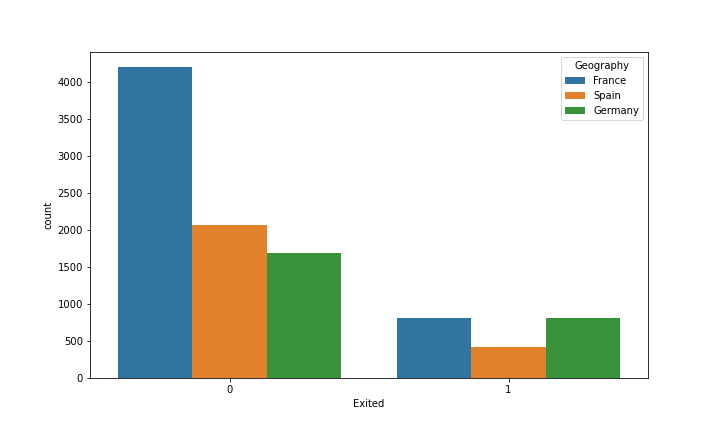
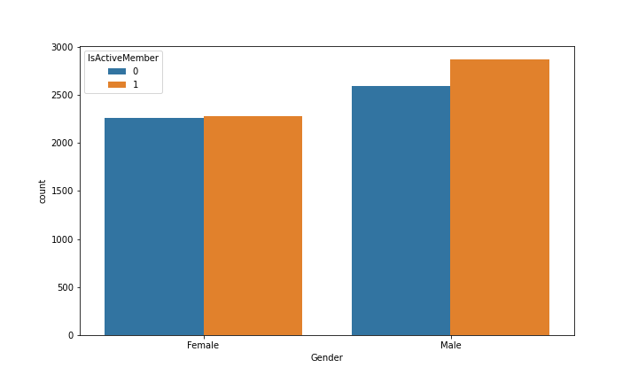

# Customer-Churn-Deep-Learning
> A model is first explored and scaled downed the features and trained using deep learning model with the help of keras and tensorflow
# Data Visualiazation
* Observing the number of active and non-active menber

* Churned ratio with respect to country

* Observing which Gender is more active Male or Female

# Techology used

> Keras

> Tensorflow

* ShyamStha 2020

